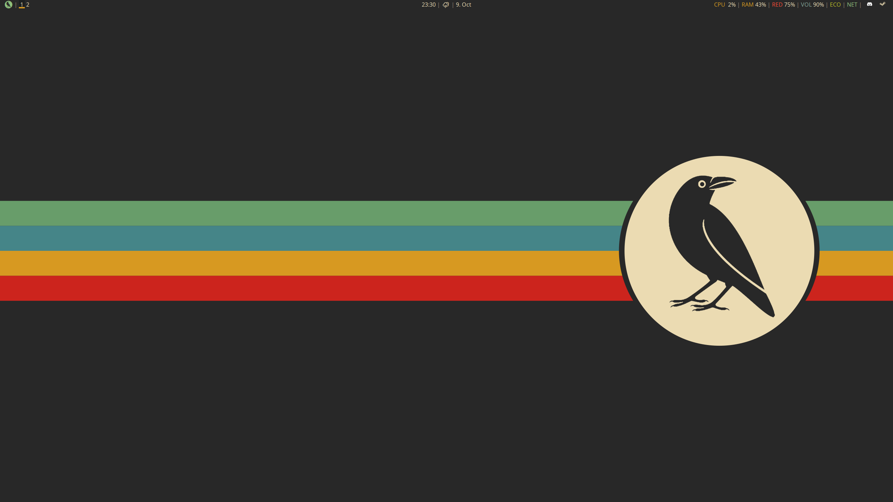
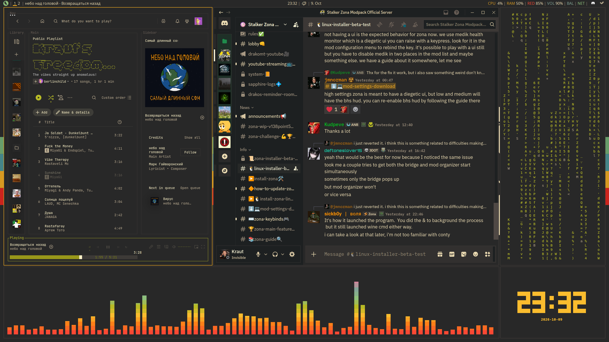

# CorvOS Desktop
### **An ultralight i3 based desktop environment, custom tailored to my personal styling tastes and maximum gaming performance while remaining suitable for daily use and productive workflow, using the Gruvbox color palette and custom panel modules.**

 

Blur? Overrated! Rounded corners? Childish! Animations? Waste of time!
This RICE is entirely focused on minimal system overhead and maximum performance while still looking incredibly sleek. *At least it does to my eyes*.

**Featuring:**
  - i3wm
  - Picom (minimalist setup)
  - Polybar
  - Rofi
  - fastfetch
  - Spicetify
  - btop
  - General GTK theming for supporting apps
 

*!Still in auditing/compiling phase!*
